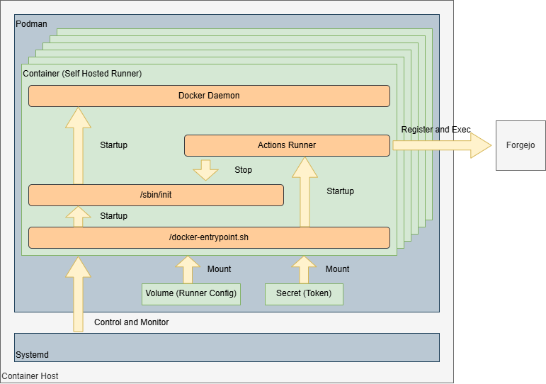

# Forgejo Actions

This runner run in container using Podman.

The container executed workflow once, then the container is stopped and is removed.
Systemd detects to stop container process, then systemd restarts container.
So, the runner is resigtered to Forgejo at first, the runner configuration is reusable.



## Build Container Image

Build container image that is self hosted runner.

Execute bellow command at *forgejo* directory.

```sh
buildah build -t runner .
```

## Prepare

Copy systemd unit file.

```sh
cp systemd/system/* /etc/systemd/system/
```

Configure bellow environment value in *actions-runner\@.service*.

- `FORGEJO_URL`
- `FORGEJO_RUNNER_NAME`
- `forgejo_runner` volume

Create token from `Create new runner` button.

```sh
printf <TOKEN> | podman secret create forgejo_token --replace -
```

Enable service.

```sh
systemctl daemon-reload
systemctl enable --now actions-runners.target
```

## Usage

Specify runner with optional labels at workflow.

```yaml
runs-on: <label-name>
```

Execute in container directly if `label-type` is `host` at `FORGEJO_RUNNER_LABELS`.
see [Choosing labels](https://forgejo.org/docs/latest/admin/actions/#choosing-labels).
